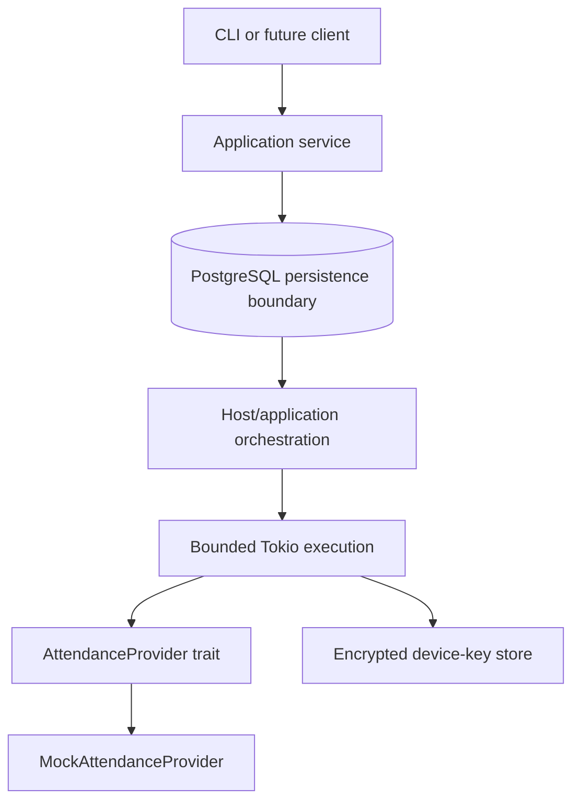

# DEYSİS Trust Boundaries

A security and reverse-engineering case study of the attendance workflow used by Dokuz Eylül University's DEYSİS platform.

The study examines client/server trust assumptions around authentication, session state, device identity, challenge-response flows, location claims, cryptographic signing, and attendance integrity. The included Rust application uses an intentionally incompatible mock protocol to demonstrate the architecture and defensive lessons safely.

> No production DEYSİS endpoints, captured traffic, credentials, provider-compatible request contracts, or attendance bypass implementation are published. This repository is not a working DEYSİS client.

## Research questions

- Which values originate from the client, and which state should be authoritative?
- What does a device key prove—and what does it not prove?
- Where does authentication stop and presence verification begin?
- How should challenges be scoped to resist replay and context confusion?
- What should survive a worker or process failure?

## Why this exists

The interesting engineering problem was not automating attendance. It was reconstructing a black-box state machine, separating observations from hypotheses, and asking which claims are actually proven at each trust boundary. The public code is a small, reviewable reproduction of those concepts—not a copy of the private implementation.

## Architecture



The mock provider has its own protocol. Its short-lived, one-time challenge is bound server-side to the user, device, session, and action; the signed request additionally covers the location claim. It is intentionally not wire-compatible with DEYSİS.

## Evidence at a glance

| Area | Classification | Public representation |
| --- | --- | --- |
| Session and device lifecycle | Observed | Generic authenticated session and P-256 identity |
| Client-originated location claim | Observed | Fictional `region:demo` claim |
| Challenge/nonce concept | Observed | Strict one-time mock challenge |
| Server-side validation | Unknown | No claim about inaccessible backend behavior |
| Production wire format | Withheld | No compatible adapter or serialization |
| Durable asynchronous execution | Independent engineering | PostgreSQL schema and bounded runner |

The classifications and their evidence basis are explained in [the evidence model](docs/evidence-model.md).

## Security properties of the public mock

| Property | Mechanism | Test |
| --- | --- | --- |
| Replay resistance | Single-use challenge | Replay test |
| Expiry | Challenge TTL | Expiry test |
| User/device/session/action binding | Server-side challenge context | Binding tests |
| Action integrity | Signature covers action context and location claim | Signature tests |
| Secret isolation | Identifier-only job payload | Queue payload test |
| Bounded work | Tokio semaphore | Concurrency invariant test |

## Repository guide

- [Architecture](docs/architecture.md) — components and trust boundaries
- [Methodology](docs/methodology.md) — how the analysis was performed
- [Evidence model](docs/evidence-model.md) — observed, inferred, hypothetical, mock, and withheld
- [State machine](docs/state-machine.md) — sanitized protocol lifecycle
- [Threat model](docs/threat-model.md) — assets, actors, and abuse cases
- [Findings](docs/findings.md) — evidence-weighted security observations
- [Mitigations](docs/mitigations.md) — defensive design options and trade-offs
- [Mock protocol](docs/mock-protocol.md) — the fictional protocol implemented here
- [Design decisions](docs/decisions/) — four decisions that shape the reproduction
- [Limitations](docs/limitations.md) — what cannot be concluded externally
- [Responsible disclosure](docs/responsible-disclosure.md)

## What this does not claim

There was no DEYSİS backend source access. External observation cannot prove the absence of hidden server validation, and the mock is not evidence of production behavior. The study describes behavior observed at the time of research and leaves unknowns labelled rather than filling them with assumptions.

## Run the safe demo

Requires Rust 1.97+.

```sh
cargo run --bin trust-boundaries-demo
cargo test
cargo clippy --all-targets --all-features -- -D warnings
```

Or run the same local gates with `just verify`.

PostgreSQL demonstrates the durable persistence boundary. `run_bounded` demonstrates bounded execution independently; the sample does not wire a persistent dequeue, lease, retry, or crash-recovery loop. The default demo does not contact any external service.

## Positioning

This is named-target defensive security research, systems engineering, and protocol analysis. It is not a cheating tool, credential harvester, exploit kit, Telegram-bot tutorial, or production integration.

## License

MIT. See [LICENSE](LICENSE).
