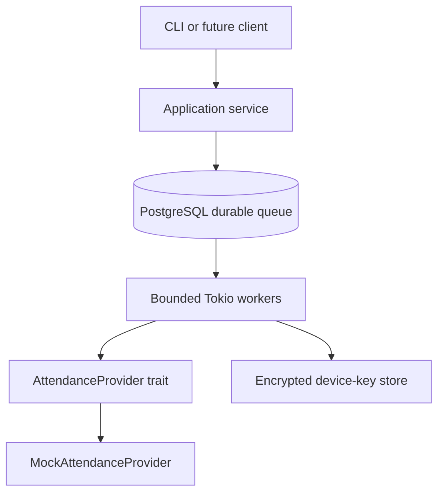

# DEYSİS Trust Boundaries

A security and reverse-engineering case study of the attendance workflow used by Dokuz Eylül University's DEYSİS platform.

The study examines client/server trust assumptions around authentication, session state, device identity, challenge-response flows, location claims, cryptographic signing, and attendance integrity. The included Rust application uses an intentionally incompatible mock protocol to demonstrate the architecture and defensive lessons safely.

> No production DEYSİS endpoints, captured traffic, credentials, provider-compatible request contracts, or attendance bypass implementation are published. This repository is not a working DEYSİS client.

## Why this exists

The interesting engineering problem was not automating attendance. It was reconstructing a black-box state machine, separating observations from hypotheses, and asking which claims are actually proven at each trust boundary. The public code is a small, reviewable reproduction of those concepts—not a copy of the private implementation.

## Architecture



The mock provider has its own protocol and binds a short-lived, one-time challenge to the user, device, session, action, and location claim. It is intentionally not wire-compatible with DEYSİS.

## Repository guide

- [Architecture](docs/architecture.md) — components and trust boundaries
- [Methodology](docs/methodology.md) — how the analysis was performed
- [Threat model](docs/threat-model.md) — assets, actors, and abuse cases
- [Findings](docs/findings.md) — evidence-weighted security observations
- [Mitigations](docs/mitigations.md) — defensive design options and trade-offs
- [Mock protocol](docs/mock-protocol.md) — the fictional protocol implemented here
- [Limitations](docs/limitations.md) — what cannot be concluded externally
- [Responsible disclosure](docs/responsible-disclosure.md)

## Run the safe demo

Requires Rust 1.85+.

```sh
cargo run --bin trust-boundaries-demo
cargo test
cargo clippy --all-targets --all-features -- -D warnings
```

PostgreSQL is included for the durable queue boundary and local experimentation. The default demo does not contact any external service.

## Positioning

This is named-target defensive security research, systems engineering, and protocol analysis. It is not a cheating tool, credential harvester, exploit kit, Telegram-bot tutorial, or production integration.

## License

MIT. See [LICENSE](LICENSE).
