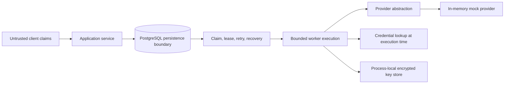

# Architecture

The private system supplied the architectural evidence for the client, service, PostgreSQL-backed durable queue, bounded worker lifecycle, device-key manager, provider client, and structured tracing. This repository preserves the reasoning and boundaries while replacing the external adapter with a fictional provider.

Trusted components are the application service, queue state, worker code, and server-side mock state. Client-submitted locations, action identifiers, and device claims are untrusted inputs. PostgreSQL durably holds queued work; the public demo's encrypted private-key store is process-local and intentionally does not claim crash durability. Sessions and challenges are ephemeral. The provider boundary is a deliberate seam: application code cannot depend on production wire details. `run_queue_once` connects transactional claim/lease/settlement to provider execution, while `run_bounded` demonstrates the separate in-process concurrency bound.

Jobs carry identifiers and action metadata only. Passwords, bearer tokens, and private signing keys are retrieved or materialized at execution time and are never serialized into the queue payload.

Queue ownership is represented by an unguessable lease token. Completion, renewal, and retry use compare-and-set conditions on that token. Expired leases are explicitly recovered and exhausted rows become terminal failures. This is an at-least-once design: external effects require provider-side idempotency or reconciliation because a process can fail after the effect but before queue settlement.

## From research to public reproduction

| Private research concept | Public representation | Why |
| --- | --- | --- |
| Provider client | `AttendanceProvider` plus mock | Preserve the boundary; remove operational integration |
| Device-key lifecycle | Encrypted process-local store used during signing | Preserve key custody and tamper detection without claiming durable secret storage |
| Durable execution | PostgreSQL claim/lease/retry/dead-letter queue | Make recovery and ownership semantics executable |
| Action challenge | Invented mock challenge | Demonstrate secure binding and replay resistance |
| Production wire format | Omitted | It is unnecessary for the architectural lesson |
