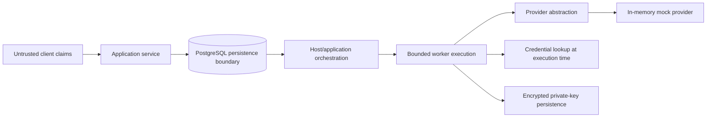

# Architecture

The private system supplied the architectural evidence for the client, service, PostgreSQL-backed durable queue, bounded worker lifecycle, device-key manager, provider client, and structured tracing. This repository preserves the reasoning and boundaries while replacing the external adapter with a fictional provider.

Trusted components are the application service, queue state, worker code, and server-side mock state. Client-submitted locations, action identifiers, and device claims are untrusted inputs. Persistent state includes queued work and encrypted key material; sessions and challenges are ephemeral. The provider boundary is a deliberate seam: application code cannot depend on production wire details. The public sample provides queue persistence and bounded execution as separate boundaries; it does not implement the orchestration that would claim and lease queued rows.

Jobs carry identifiers and action metadata only. Passwords, bearer tokens, and private signing keys are retrieved or materialized at execution time and are never serialized into the queue payload.

## From research to public reproduction

| Private research concept | Public representation | Why |
| --- | --- | --- |
| Provider client | `AttendanceProvider` plus mock | Preserve the boundary; remove operational integration |
| Device-key lifecycle | Encrypted demo key | Preserve key custody and tamper detection |
| Durable execution | PostgreSQL queue schema | Preserve the systems lesson |
| Action challenge | Invented mock challenge | Demonstrate secure binding and replay resistance |
| Production wire format | Omitted | It is unnecessary for the architectural lesson |
